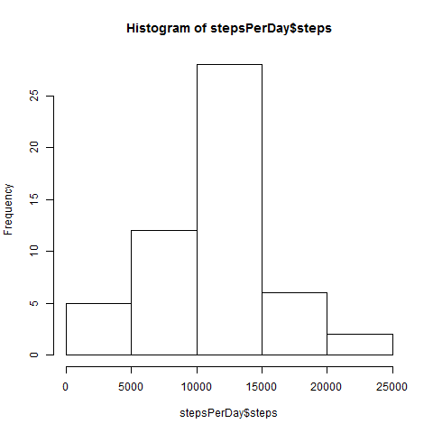
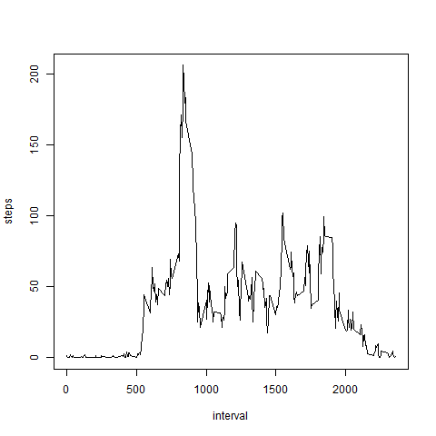
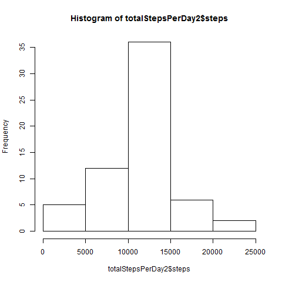

# Repro Research 1
KristenDardia  
April 21, 2017  


##Reproducible Research - Assignment 1
============================================
Can get data here: https://d396qusza40orc.cloudfront.net/repdata%2Fdata%2Factivity.zip


##Load data


```r
unzip("./activity.zip")
```

```
## Warning in unzip("./activity.zip"): error 1 in extracting from zip file
```

```r
activity <- read.csv("./activity.csv")
summary(activity)
```

```
##      steps                date          interval     
##  Min.   :  0.00   2012-10-01:  288   Min.   :   0.0  
##  1st Qu.:  0.00   2012-10-02:  288   1st Qu.: 588.8  
##  Median :  0.00   2012-10-03:  288   Median :1177.5  
##  Mean   : 37.38   2012-10-04:  288   Mean   :1177.5  
##  3rd Qu.: 12.00   2012-10-05:  288   3rd Qu.:1766.2  
##  Max.   :806.00   2012-10-06:  288   Max.   :2355.0  
##  NA's   :2304     (Other)   :15840
```

```r
names(activity)
```

```
## [1] "steps"    "date"     "interval"
```

```r
head(activity)
```

```
##   steps       date interval
## 1    NA 2012-10-01        0
## 2    NA 2012-10-01        5
## 3    NA 2012-10-01       10
## 4    NA 2012-10-01       15
## 5    NA 2012-10-01       20
## 6    NA 2012-10-01       25
```

```r
pairs(activity)
```

<!-- -->

##Part 1: What is mean total number of steps taken per day?

Calculate the total number of steps taken per day

```r
stepsPerDay <- aggregate(steps ~ date, activity, sum, na.rm=TRUE)
```

Make a histogram

```r
hist(stepsPerDay$steps)
```

<!-- -->

Calculate and report the mean and median of the total number of steps taken per day

```r
meanStepsPerDay <- mean(stepsPerDay$steps)
medianStepsPerDay <- median(stepsPerDay$steps)
meanStepsPerDay
```

```
## [1] 10766.19
```

```r
medianStepsPerDay
```

```
## [1] 10765
```

##Part 2: What is the average daily activity pattern?

Make a time series plot (i.e. type = "l") of the 5-minute interval (x-axis) 
and the average number of steps taken, averaged across all days (y-axis)


```r
stepsPerint<-aggregate(steps~interval, data=activity, mean, na.rm=TRUE)
plot(steps~interval, data=stepsPerint, type="l")
```

<!-- -->

Which 5-minute interval, on average across all the days in the dataset, contains the maximum number of steps?


```r
intervalmax <- stepsPerint[which.max(stepsPerint$steps),]$interval
intervalmax
```

```
## [1] 835
```

##Step 3: Imputing missing values

Calculate and report the total number of missing values in the dataset (i.e. the total number of rows with NAs)

```r
Missings <- sum(is.na(activity$steps))
Missings
```

```
## [1] 2304
```

Devise a strategy for filling in all of the missing values in the dataset. The strategy does not need to be sophisticated. 
For example, you could use the mean/median for that day, or the mean for that 5-minute interval, etc.
I'll use the mean for the interval


```r
mean<-function(interval){
    stepsPerint[stepsPerint$interval==interval,]$steps
}
```

Create a new dataset that is equal to the original dataset but with the missing data filled in.

```r
activity2<-activity

for(i in 1:nrow(activity2)){
    if(is.na(activity2[i,]$steps)){
        activity2[i,]$steps <- mean(activity2[i,]$interval)
    }
}
```

Make a histogram of the total number of steps taken each day and Calculate and report the mean and median total 
number of steps taken per day. Do these values differ from the estimates from the first part of the assignment? 
What is the impact of imputing missing data on the estimates of the total daily number of steps?


```r
totalStepsPerDay2 <- aggregate(steps ~ date, data=activity2, sum)
hist(totalStepsPerDay2$steps)
```

<!-- -->

```r
meanStepsPerDay2 <- mean(totalStepsPerDay2$steps)
```

```
## Warning in stepsPerint$interval == interval: longer object length is not a
## multiple of shorter object length
```

```r
medianStepsPerDay2 <- median(totalStepsPerDay2$steps)
meanStepsPerDay2
```

```
## numeric(0)
```

```r
medianStepsPerDay2
```

```
## [1] 10766.19
```

The mean didn't change after the replacements of NAs & the median changed a little.  This didnt' have much of an impact.

##Part 4: Are there differences in activity patterns between weekdays and weekends?

Create a new factor variable in the dataset with two levels - "weekday" and "weekend" 
indicating whether a given date is a weekday or weekend day.


```r
activity2$date <- as.Date(strptime(activity2$date, format="%Y-%m-%d"))
activity2$day <- weekdays(activity2$date)

for (i in 1:nrow(activity2)) {
    if (activity2[i,]$day %in% c("Saturday","Sunday")) {
        activity2[i,]$day<-"weekend"
    }
    else{
        activity2[i,]$day<-"weekday"
    }
}
stepsByDay <- aggregate(activity2$steps ~ activity2$interval + activity2$day, activity2, mean)
```

```
## Warning in stepsPerint$interval == interval: longer object length is not a
## multiple of shorter object length

## Warning in stepsPerint$interval == interval: longer object length is not a
## multiple of shorter object length

## Warning in stepsPerint$interval == interval: longer object length is not a
## multiple of shorter object length

## Warning in stepsPerint$interval == interval: longer object length is not a
## multiple of shorter object length

## Warning in stepsPerint$interval == interval: longer object length is not a
## multiple of shorter object length

## Warning in stepsPerint$interval == interval: longer object length is not a
## multiple of shorter object length

## Warning in stepsPerint$interval == interval: longer object length is not a
## multiple of shorter object length

## Warning in stepsPerint$interval == interval: longer object length is not a
## multiple of shorter object length

## Warning in stepsPerint$interval == interval: longer object length is not a
## multiple of shorter object length

## Warning in stepsPerint$interval == interval: longer object length is not a
## multiple of shorter object length

## Warning in stepsPerint$interval == interval: longer object length is not a
## multiple of shorter object length

## Warning in stepsPerint$interval == interval: longer object length is not a
## multiple of shorter object length

## Warning in stepsPerint$interval == interval: longer object length is not a
## multiple of shorter object length

## Warning in stepsPerint$interval == interval: longer object length is not a
## multiple of shorter object length

## Warning in stepsPerint$interval == interval: longer object length is not a
## multiple of shorter object length

## Warning in stepsPerint$interval == interval: longer object length is not a
## multiple of shorter object length

## Warning in stepsPerint$interval == interval: longer object length is not a
## multiple of shorter object length

## Warning in stepsPerint$interval == interval: longer object length is not a
## multiple of shorter object length

## Warning in stepsPerint$interval == interval: longer object length is not a
## multiple of shorter object length

## Warning in stepsPerint$interval == interval: longer object length is not a
## multiple of shorter object length

## Warning in stepsPerint$interval == interval: longer object length is not a
## multiple of shorter object length

## Warning in stepsPerint$interval == interval: longer object length is not a
## multiple of shorter object length

## Warning in stepsPerint$interval == interval: longer object length is not a
## multiple of shorter object length

## Warning in stepsPerint$interval == interval: longer object length is not a
## multiple of shorter object length

## Warning in stepsPerint$interval == interval: longer object length is not a
## multiple of shorter object length

## Warning in stepsPerint$interval == interval: longer object length is not a
## multiple of shorter object length

## Warning in stepsPerint$interval == interval: longer object length is not a
## multiple of shorter object length

## Warning in stepsPerint$interval == interval: longer object length is not a
## multiple of shorter object length

## Warning in stepsPerint$interval == interval: longer object length is not a
## multiple of shorter object length

## Warning in stepsPerint$interval == interval: longer object length is not a
## multiple of shorter object length

## Warning in stepsPerint$interval == interval: longer object length is not a
## multiple of shorter object length

## Warning in stepsPerint$interval == interval: longer object length is not a
## multiple of shorter object length

## Warning in stepsPerint$interval == interval: longer object length is not a
## multiple of shorter object length

## Warning in stepsPerint$interval == interval: longer object length is not a
## multiple of shorter object length

## Warning in stepsPerint$interval == interval: longer object length is not a
## multiple of shorter object length

## Warning in stepsPerint$interval == interval: longer object length is not a
## multiple of shorter object length

## Warning in stepsPerint$interval == interval: longer object length is not a
## multiple of shorter object length

## Warning in stepsPerint$interval == interval: longer object length is not a
## multiple of shorter object length

## Warning in stepsPerint$interval == interval: longer object length is not a
## multiple of shorter object length

## Warning in stepsPerint$interval == interval: longer object length is not a
## multiple of shorter object length

## Warning in stepsPerint$interval == interval: longer object length is not a
## multiple of shorter object length

## Warning in stepsPerint$interval == interval: longer object length is not a
## multiple of shorter object length

## Warning in stepsPerint$interval == interval: longer object length is not a
## multiple of shorter object length

## Warning in stepsPerint$interval == interval: longer object length is not a
## multiple of shorter object length

## Warning in stepsPerint$interval == interval: longer object length is not a
## multiple of shorter object length

## Warning in stepsPerint$interval == interval: longer object length is not a
## multiple of shorter object length

## Warning in stepsPerint$interval == interval: longer object length is not a
## multiple of shorter object length

## Warning in stepsPerint$interval == interval: longer object length is not a
## multiple of shorter object length

## Warning in stepsPerint$interval == interval: longer object length is not a
## multiple of shorter object length

## Warning in stepsPerint$interval == interval: longer object length is not a
## multiple of shorter object length

## Warning in stepsPerint$interval == interval: longer object length is not a
## multiple of shorter object length

## Warning in stepsPerint$interval == interval: longer object length is not a
## multiple of shorter object length

## Warning in stepsPerint$interval == interval: longer object length is not a
## multiple of shorter object length

## Warning in stepsPerint$interval == interval: longer object length is not a
## multiple of shorter object length

## Warning in stepsPerint$interval == interval: longer object length is not a
## multiple of shorter object length

## Warning in stepsPerint$interval == interval: longer object length is not a
## multiple of shorter object length

## Warning in stepsPerint$interval == interval: longer object length is not a
## multiple of shorter object length

## Warning in stepsPerint$interval == interval: longer object length is not a
## multiple of shorter object length

## Warning in stepsPerint$interval == interval: longer object length is not a
## multiple of shorter object length

## Warning in stepsPerint$interval == interval: longer object length is not a
## multiple of shorter object length

## Warning in stepsPerint$interval == interval: longer object length is not a
## multiple of shorter object length

## Warning in stepsPerint$interval == interval: longer object length is not a
## multiple of shorter object length

## Warning in stepsPerint$interval == interval: longer object length is not a
## multiple of shorter object length

## Warning in stepsPerint$interval == interval: longer object length is not a
## multiple of shorter object length

## Warning in stepsPerint$interval == interval: longer object length is not a
## multiple of shorter object length

## Warning in stepsPerint$interval == interval: longer object length is not a
## multiple of shorter object length

## Warning in stepsPerint$interval == interval: longer object length is not a
## multiple of shorter object length

## Warning in stepsPerint$interval == interval: longer object length is not a
## multiple of shorter object length

## Warning in stepsPerint$interval == interval: longer object length is not a
## multiple of shorter object length

## Warning in stepsPerint$interval == interval: longer object length is not a
## multiple of shorter object length

## Warning in stepsPerint$interval == interval: longer object length is not a
## multiple of shorter object length

## Warning in stepsPerint$interval == interval: longer object length is not a
## multiple of shorter object length

## Warning in stepsPerint$interval == interval: longer object length is not a
## multiple of shorter object length

## Warning in stepsPerint$interval == interval: longer object length is not a
## multiple of shorter object length

## Warning in stepsPerint$interval == interval: longer object length is not a
## multiple of shorter object length

## Warning in stepsPerint$interval == interval: longer object length is not a
## multiple of shorter object length

## Warning in stepsPerint$interval == interval: longer object length is not a
## multiple of shorter object length

## Warning in stepsPerint$interval == interval: longer object length is not a
## multiple of shorter object length

## Warning in stepsPerint$interval == interval: longer object length is not a
## multiple of shorter object length

## Warning in stepsPerint$interval == interval: longer object length is not a
## multiple of shorter object length

## Warning in stepsPerint$interval == interval: longer object length is not a
## multiple of shorter object length

## Warning in stepsPerint$interval == interval: longer object length is not a
## multiple of shorter object length

## Warning in stepsPerint$interval == interval: longer object length is not a
## multiple of shorter object length

## Warning in stepsPerint$interval == interval: longer object length is not a
## multiple of shorter object length

## Warning in stepsPerint$interval == interval: longer object length is not a
## multiple of shorter object length

## Warning in stepsPerint$interval == interval: longer object length is not a
## multiple of shorter object length

## Warning in stepsPerint$interval == interval: longer object length is not a
## multiple of shorter object length

## Warning in stepsPerint$interval == interval: longer object length is not a
## multiple of shorter object length

## Warning in stepsPerint$interval == interval: longer object length is not a
## multiple of shorter object length

## Warning in stepsPerint$interval == interval: longer object length is not a
## multiple of shorter object length

## Warning in stepsPerint$interval == interval: longer object length is not a
## multiple of shorter object length

## Warning in stepsPerint$interval == interval: longer object length is not a
## multiple of shorter object length

## Warning in stepsPerint$interval == interval: longer object length is not a
## multiple of shorter object length

## Warning in stepsPerint$interval == interval: longer object length is not a
## multiple of shorter object length

## Warning in stepsPerint$interval == interval: longer object length is not a
## multiple of shorter object length

## Warning in stepsPerint$interval == interval: longer object length is not a
## multiple of shorter object length

## Warning in stepsPerint$interval == interval: longer object length is not a
## multiple of shorter object length

## Warning in stepsPerint$interval == interval: longer object length is not a
## multiple of shorter object length

## Warning in stepsPerint$interval == interval: longer object length is not a
## multiple of shorter object length

## Warning in stepsPerint$interval == interval: longer object length is not a
## multiple of shorter object length

## Warning in stepsPerint$interval == interval: longer object length is not a
## multiple of shorter object length

## Warning in stepsPerint$interval == interval: longer object length is not a
## multiple of shorter object length

## Warning in stepsPerint$interval == interval: longer object length is not a
## multiple of shorter object length

## Warning in stepsPerint$interval == interval: longer object length is not a
## multiple of shorter object length

## Warning in stepsPerint$interval == interval: longer object length is not a
## multiple of shorter object length

## Warning in stepsPerint$interval == interval: longer object length is not a
## multiple of shorter object length

## Warning in stepsPerint$interval == interval: longer object length is not a
## multiple of shorter object length

## Warning in stepsPerint$interval == interval: longer object length is not a
## multiple of shorter object length

## Warning in stepsPerint$interval == interval: longer object length is not a
## multiple of shorter object length

## Warning in stepsPerint$interval == interval: longer object length is not a
## multiple of shorter object length

## Warning in stepsPerint$interval == interval: longer object length is not a
## multiple of shorter object length

## Warning in stepsPerint$interval == interval: longer object length is not a
## multiple of shorter object length

## Warning in stepsPerint$interval == interval: longer object length is not a
## multiple of shorter object length

## Warning in stepsPerint$interval == interval: longer object length is not a
## multiple of shorter object length

## Warning in stepsPerint$interval == interval: longer object length is not a
## multiple of shorter object length

## Warning in stepsPerint$interval == interval: longer object length is not a
## multiple of shorter object length

## Warning in stepsPerint$interval == interval: longer object length is not a
## multiple of shorter object length

## Warning in stepsPerint$interval == interval: longer object length is not a
## multiple of shorter object length

## Warning in stepsPerint$interval == interval: longer object length is not a
## multiple of shorter object length

## Warning in stepsPerint$interval == interval: longer object length is not a
## multiple of shorter object length

## Warning in stepsPerint$interval == interval: longer object length is not a
## multiple of shorter object length

## Warning in stepsPerint$interval == interval: longer object length is not a
## multiple of shorter object length

## Warning in stepsPerint$interval == interval: longer object length is not a
## multiple of shorter object length

## Warning in stepsPerint$interval == interval: longer object length is not a
## multiple of shorter object length

## Warning in stepsPerint$interval == interval: longer object length is not a
## multiple of shorter object length

## Warning in stepsPerint$interval == interval: longer object length is not a
## multiple of shorter object length

## Warning in stepsPerint$interval == interval: longer object length is not a
## multiple of shorter object length

## Warning in stepsPerint$interval == interval: longer object length is not a
## multiple of shorter object length

## Warning in stepsPerint$interval == interval: longer object length is not a
## multiple of shorter object length

## Warning in stepsPerint$interval == interval: longer object length is not a
## multiple of shorter object length

## Warning in stepsPerint$interval == interval: longer object length is not a
## multiple of shorter object length

## Warning in stepsPerint$interval == interval: longer object length is not a
## multiple of shorter object length

## Warning in stepsPerint$interval == interval: longer object length is not a
## multiple of shorter object length

## Warning in stepsPerint$interval == interval: longer object length is not a
## multiple of shorter object length

## Warning in stepsPerint$interval == interval: longer object length is not a
## multiple of shorter object length

## Warning in stepsPerint$interval == interval: longer object length is not a
## multiple of shorter object length

## Warning in stepsPerint$interval == interval: longer object length is not a
## multiple of shorter object length

## Warning in stepsPerint$interval == interval: longer object length is not a
## multiple of shorter object length

## Warning in stepsPerint$interval == interval: longer object length is not a
## multiple of shorter object length

## Warning in stepsPerint$interval == interval: longer object length is not a
## multiple of shorter object length

## Warning in stepsPerint$interval == interval: longer object length is not a
## multiple of shorter object length

## Warning in stepsPerint$interval == interval: longer object length is not a
## multiple of shorter object length

## Warning in stepsPerint$interval == interval: longer object length is not a
## multiple of shorter object length

## Warning in stepsPerint$interval == interval: longer object length is not a
## multiple of shorter object length

## Warning in stepsPerint$interval == interval: longer object length is not a
## multiple of shorter object length

## Warning in stepsPerint$interval == interval: longer object length is not a
## multiple of shorter object length

## Warning in stepsPerint$interval == interval: longer object length is not a
## multiple of shorter object length

## Warning in stepsPerint$interval == interval: longer object length is not a
## multiple of shorter object length

## Warning in stepsPerint$interval == interval: longer object length is not a
## multiple of shorter object length

## Warning in stepsPerint$interval == interval: longer object length is not a
## multiple of shorter object length

## Warning in stepsPerint$interval == interval: longer object length is not a
## multiple of shorter object length

## Warning in stepsPerint$interval == interval: longer object length is not a
## multiple of shorter object length

## Warning in stepsPerint$interval == interval: longer object length is not a
## multiple of shorter object length

## Warning in stepsPerint$interval == interval: longer object length is not a
## multiple of shorter object length

## Warning in stepsPerint$interval == interval: longer object length is not a
## multiple of shorter object length

## Warning in stepsPerint$interval == interval: longer object length is not a
## multiple of shorter object length

## Warning in stepsPerint$interval == interval: longer object length is not a
## multiple of shorter object length

## Warning in stepsPerint$interval == interval: longer object length is not a
## multiple of shorter object length

## Warning in stepsPerint$interval == interval: longer object length is not a
## multiple of shorter object length

## Warning in stepsPerint$interval == interval: longer object length is not a
## multiple of shorter object length

## Warning in stepsPerint$interval == interval: longer object length is not a
## multiple of shorter object length

## Warning in stepsPerint$interval == interval: longer object length is not a
## multiple of shorter object length

## Warning in stepsPerint$interval == interval: longer object length is not a
## multiple of shorter object length

## Warning in stepsPerint$interval == interval: longer object length is not a
## multiple of shorter object length

## Warning in stepsPerint$interval == interval: longer object length is not a
## multiple of shorter object length

## Warning in stepsPerint$interval == interval: longer object length is not a
## multiple of shorter object length

## Warning in stepsPerint$interval == interval: longer object length is not a
## multiple of shorter object length

## Warning in stepsPerint$interval == interval: longer object length is not a
## multiple of shorter object length

## Warning in stepsPerint$interval == interval: longer object length is not a
## multiple of shorter object length

## Warning in stepsPerint$interval == interval: longer object length is not a
## multiple of shorter object length

## Warning in stepsPerint$interval == interval: longer object length is not a
## multiple of shorter object length

## Warning in stepsPerint$interval == interval: longer object length is not a
## multiple of shorter object length

## Warning in stepsPerint$interval == interval: longer object length is not a
## multiple of shorter object length

## Warning in stepsPerint$interval == interval: longer object length is not a
## multiple of shorter object length

## Warning in stepsPerint$interval == interval: longer object length is not a
## multiple of shorter object length

## Warning in stepsPerint$interval == interval: longer object length is not a
## multiple of shorter object length

## Warning in stepsPerint$interval == interval: longer object length is not a
## multiple of shorter object length

## Warning in stepsPerint$interval == interval: longer object length is not a
## multiple of shorter object length

## Warning in stepsPerint$interval == interval: longer object length is not a
## multiple of shorter object length

## Warning in stepsPerint$interval == interval: longer object length is not a
## multiple of shorter object length

## Warning in stepsPerint$interval == interval: longer object length is not a
## multiple of shorter object length

## Warning in stepsPerint$interval == interval: longer object length is not a
## multiple of shorter object length

## Warning in stepsPerint$interval == interval: longer object length is not a
## multiple of shorter object length

## Warning in stepsPerint$interval == interval: longer object length is not a
## multiple of shorter object length

## Warning in stepsPerint$interval == interval: longer object length is not a
## multiple of shorter object length

## Warning in stepsPerint$interval == interval: longer object length is not a
## multiple of shorter object length

## Warning in stepsPerint$interval == interval: longer object length is not a
## multiple of shorter object length

## Warning in stepsPerint$interval == interval: longer object length is not a
## multiple of shorter object length

## Warning in stepsPerint$interval == interval: longer object length is not a
## multiple of shorter object length

## Warning in stepsPerint$interval == interval: longer object length is not a
## multiple of shorter object length

## Warning in stepsPerint$interval == interval: longer object length is not a
## multiple of shorter object length

## Warning in stepsPerint$interval == interval: longer object length is not a
## multiple of shorter object length

## Warning in stepsPerint$interval == interval: longer object length is not a
## multiple of shorter object length

## Warning in stepsPerint$interval == interval: longer object length is not a
## multiple of shorter object length

## Warning in stepsPerint$interval == interval: longer object length is not a
## multiple of shorter object length

## Warning in stepsPerint$interval == interval: longer object length is not a
## multiple of shorter object length

## Warning in stepsPerint$interval == interval: longer object length is not a
## multiple of shorter object length

## Warning in stepsPerint$interval == interval: longer object length is not a
## multiple of shorter object length

## Warning in stepsPerint$interval == interval: longer object length is not a
## multiple of shorter object length

## Warning in stepsPerint$interval == interval: longer object length is not a
## multiple of shorter object length

## Warning in stepsPerint$interval == interval: longer object length is not a
## multiple of shorter object length

## Warning in stepsPerint$interval == interval: longer object length is not a
## multiple of shorter object length

## Warning in stepsPerint$interval == interval: longer object length is not a
## multiple of shorter object length

## Warning in stepsPerint$interval == interval: longer object length is not a
## multiple of shorter object length

## Warning in stepsPerint$interval == interval: longer object length is not a
## multiple of shorter object length

## Warning in stepsPerint$interval == interval: longer object length is not a
## multiple of shorter object length

## Warning in stepsPerint$interval == interval: longer object length is not a
## multiple of shorter object length

## Warning in stepsPerint$interval == interval: longer object length is not a
## multiple of shorter object length

## Warning in stepsPerint$interval == interval: longer object length is not a
## multiple of shorter object length

## Warning in stepsPerint$interval == interval: longer object length is not a
## multiple of shorter object length

## Warning in stepsPerint$interval == interval: longer object length is not a
## multiple of shorter object length

## Warning in stepsPerint$interval == interval: longer object length is not a
## multiple of shorter object length

## Warning in stepsPerint$interval == interval: longer object length is not a
## multiple of shorter object length

## Warning in stepsPerint$interval == interval: longer object length is not a
## multiple of shorter object length

## Warning in stepsPerint$interval == interval: longer object length is not a
## multiple of shorter object length

## Warning in stepsPerint$interval == interval: longer object length is not a
## multiple of shorter object length

## Warning in stepsPerint$interval == interval: longer object length is not a
## multiple of shorter object length

## Warning in stepsPerint$interval == interval: longer object length is not a
## multiple of shorter object length

## Warning in stepsPerint$interval == interval: longer object length is not a
## multiple of shorter object length

## Warning in stepsPerint$interval == interval: longer object length is not a
## multiple of shorter object length

## Warning in stepsPerint$interval == interval: longer object length is not a
## multiple of shorter object length

## Warning in stepsPerint$interval == interval: longer object length is not a
## multiple of shorter object length

## Warning in stepsPerint$interval == interval: longer object length is not a
## multiple of shorter object length

## Warning in stepsPerint$interval == interval: longer object length is not a
## multiple of shorter object length

## Warning in stepsPerint$interval == interval: longer object length is not a
## multiple of shorter object length

## Warning in stepsPerint$interval == interval: longer object length is not a
## multiple of shorter object length

## Warning in stepsPerint$interval == interval: longer object length is not a
## multiple of shorter object length

## Warning in stepsPerint$interval == interval: longer object length is not a
## multiple of shorter object length

## Warning in stepsPerint$interval == interval: longer object length is not a
## multiple of shorter object length

## Warning in stepsPerint$interval == interval: longer object length is not a
## multiple of shorter object length

## Warning in stepsPerint$interval == interval: longer object length is not a
## multiple of shorter object length

## Warning in stepsPerint$interval == interval: longer object length is not a
## multiple of shorter object length

## Warning in stepsPerint$interval == interval: longer object length is not a
## multiple of shorter object length

## Warning in stepsPerint$interval == interval: longer object length is not a
## multiple of shorter object length

## Warning in stepsPerint$interval == interval: longer object length is not a
## multiple of shorter object length

## Warning in stepsPerint$interval == interval: longer object length is not a
## multiple of shorter object length

## Warning in stepsPerint$interval == interval: longer object length is not a
## multiple of shorter object length

## Warning in stepsPerint$interval == interval: longer object length is not a
## multiple of shorter object length

## Warning in stepsPerint$interval == interval: longer object length is not a
## multiple of shorter object length

## Warning in stepsPerint$interval == interval: longer object length is not a
## multiple of shorter object length

## Warning in stepsPerint$interval == interval: longer object length is not a
## multiple of shorter object length

## Warning in stepsPerint$interval == interval: longer object length is not a
## multiple of shorter object length

## Warning in stepsPerint$interval == interval: longer object length is not a
## multiple of shorter object length

## Warning in stepsPerint$interval == interval: longer object length is not a
## multiple of shorter object length

## Warning in stepsPerint$interval == interval: longer object length is not a
## multiple of shorter object length

## Warning in stepsPerint$interval == interval: longer object length is not a
## multiple of shorter object length

## Warning in stepsPerint$interval == interval: longer object length is not a
## multiple of shorter object length

## Warning in stepsPerint$interval == interval: longer object length is not a
## multiple of shorter object length

## Warning in stepsPerint$interval == interval: longer object length is not a
## multiple of shorter object length

## Warning in stepsPerint$interval == interval: longer object length is not a
## multiple of shorter object length

## Warning in stepsPerint$interval == interval: longer object length is not a
## multiple of shorter object length

## Warning in stepsPerint$interval == interval: longer object length is not a
## multiple of shorter object length

## Warning in stepsPerint$interval == interval: longer object length is not a
## multiple of shorter object length

## Warning in stepsPerint$interval == interval: longer object length is not a
## multiple of shorter object length

## Warning in stepsPerint$interval == interval: longer object length is not a
## multiple of shorter object length

## Warning in stepsPerint$interval == interval: longer object length is not a
## multiple of shorter object length

## Warning in stepsPerint$interval == interval: longer object length is not a
## multiple of shorter object length

## Warning in stepsPerint$interval == interval: longer object length is not a
## multiple of shorter object length

## Warning in stepsPerint$interval == interval: longer object length is not a
## multiple of shorter object length

## Warning in stepsPerint$interval == interval: longer object length is not a
## multiple of shorter object length

## Warning in stepsPerint$interval == interval: longer object length is not a
## multiple of shorter object length

## Warning in stepsPerint$interval == interval: longer object length is not a
## multiple of shorter object length

## Warning in stepsPerint$interval == interval: longer object length is not a
## multiple of shorter object length

## Warning in stepsPerint$interval == interval: longer object length is not a
## multiple of shorter object length

## Warning in stepsPerint$interval == interval: longer object length is not a
## multiple of shorter object length

## Warning in stepsPerint$interval == interval: longer object length is not a
## multiple of shorter object length

## Warning in stepsPerint$interval == interval: longer object length is not a
## multiple of shorter object length

## Warning in stepsPerint$interval == interval: longer object length is not a
## multiple of shorter object length

## Warning in stepsPerint$interval == interval: longer object length is not a
## multiple of shorter object length

## Warning in stepsPerint$interval == interval: longer object length is not a
## multiple of shorter object length

## Warning in stepsPerint$interval == interval: longer object length is not a
## multiple of shorter object length

## Warning in stepsPerint$interval == interval: longer object length is not a
## multiple of shorter object length

## Warning in stepsPerint$interval == interval: longer object length is not a
## multiple of shorter object length

## Warning in stepsPerint$interval == interval: longer object length is not a
## multiple of shorter object length

## Warning in stepsPerint$interval == interval: longer object length is not a
## multiple of shorter object length

## Warning in stepsPerint$interval == interval: longer object length is not a
## multiple of shorter object length

## Warning in stepsPerint$interval == interval: longer object length is not a
## multiple of shorter object length

## Warning in stepsPerint$interval == interval: longer object length is not a
## multiple of shorter object length

## Warning in stepsPerint$interval == interval: longer object length is not a
## multiple of shorter object length

## Warning in stepsPerint$interval == interval: longer object length is not a
## multiple of shorter object length

## Warning in stepsPerint$interval == interval: longer object length is not a
## multiple of shorter object length

## Warning in stepsPerint$interval == interval: longer object length is not a
## multiple of shorter object length

## Warning in stepsPerint$interval == interval: longer object length is not a
## multiple of shorter object length

## Warning in stepsPerint$interval == interval: longer object length is not a
## multiple of shorter object length

## Warning in stepsPerint$interval == interval: longer object length is not a
## multiple of shorter object length

## Warning in stepsPerint$interval == interval: longer object length is not a
## multiple of shorter object length

## Warning in stepsPerint$interval == interval: longer object length is not a
## multiple of shorter object length

## Warning in stepsPerint$interval == interval: longer object length is not a
## multiple of shorter object length
```
